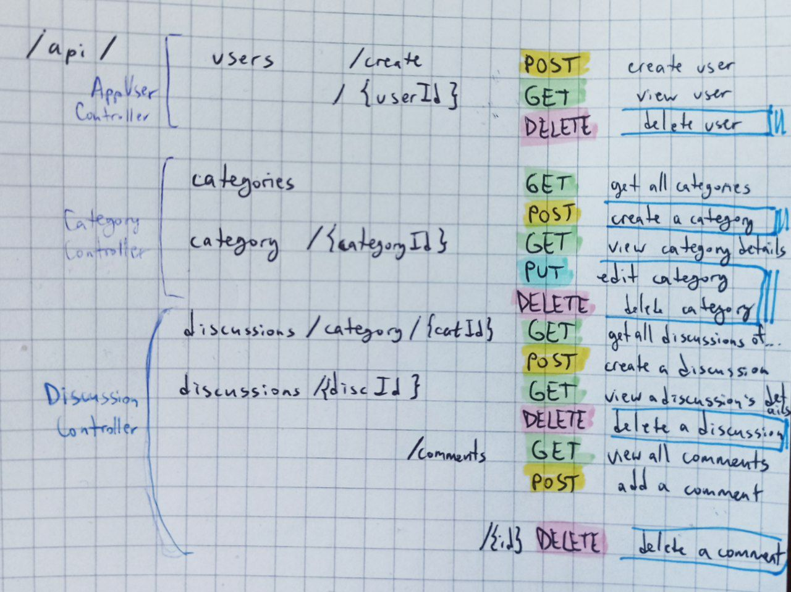

# Discussion Platform API

This RESTful API allows users to create and manage discussions on various topics, categorized and moderated by administrators. The API provides endpoints for managing users, categories, discussions, and comments.

Rapport on the project in : doc/Rapport.pdf

## Features:
- Users can post discussions and respond to others.
- Discussions are categorized for better organization.
- Admins can manage categories and moderate discussions.

## Endpoints

### Base URL
All endpoints are prefixed with /api.

### Schema

The endpoints and possible actions are outlined on the schema below, and further described below. 

The actions marked with blue outline (such as delete user) are those that are only permitted to be executed by the administrators.

(!) the mapping of the 'DELETE COMMENT' was changed compared to the schema, [view here](###delete-a-Comment).

## **Users API**

Base URL: `/api/users`

### **Create a User**
**Endpoint:**  
`POST /api/users/create`

**Description:**  
Creates a new user.

**Parameters:**
- `username` (String): The username of the new user.
- `password` (String): The password for the new user.
- `role` (String): The role of the user (e.g., `USER`, `ADMIN`).

**Response:**  
- **200 OK**: Returns the created user object.

---

### **Get User by ID**
**Endpoint:**  
`GET /api/users/{userId}`

**Description:**  
Fetches the details of a user by their ID.

**Parameters:**
- `userId` (Long): The ID of the user.

**Response:**  
- **200 OK**: Returns the user details.
- **404 Not Found**: If the user does not exist.

---

### **Delete User**  
**Endpoint:**  
`DELETE /api/users/{userId}`

**Description:**  
Deletes a user by their ID. **Admin-only operation**.

**Parameters:**  
- `userId` (Long): The ID of the user to be deleted.

**Response:**  
- **200 OK**: If the user was successfully deleted.
- **403 Forbidden**: If the user does not have the required permissions.
- **404 Not Found**: If the user does not exist.

---

## **Category API**

### **Get All Categories**  
**Endpoint:**  
`GET /api/categories`

**Description:**  
Fetches a paginated list of all categories.

**Parameters:**  
- `page` (Integer, optional): The page number (default is `0`).
- `size` (Integer, optional): The number of items per page (default is `10`).

**Response:**  
- **200 OK**: Returns a paginated list of categories.

---

### **Create a Category**  
**Endpoint:**  
`POST /api/categories`

**Description:**  
Creates a new category. **Admin-only operation**.

**Parameters:**  
- `name` (String): The name of the category.

**Response:**  
- **200 OK**: Returns the created category object.
- **403 Forbidden**: If the user does not have the required permissions.

---

### **Get Category by ID**  
**Endpoint:**  
`GET /api/category/{categoryId}`

**Description:**  
Fetches the details of a category by its ID.

**Parameters:**  
- `categoryId` (Long): The ID of the category.

**Response:**  
- **200 OK**: Returns the category details.
- **404 Not Found**: If the category does not exist.

---

### **Edit Category**  
**Endpoint:**  
`PUT /api/category/{categoryId}`

**Description:**  
Updates the name of a category by its ID.**Admin-only operation**.

**Parameters:**  
- `categoryId` (Long): The ID of the category to be updated.
- `newName` (String): The new name for the category.

**Response:**  
- **200 OK**: Returns the updated category object.
- **403 Forbidden**: If the user does not have the required permissions.
- **404 Not Found**: If the category does not exist.

---

### **Delete Category**  
**Endpoint:**  
`DELETE /api/category/{categoryId}`

**Description:**  
Deletes a category by its ID. **Admin-only operation**.

**Parameters:**  
- `categoryId` (Long): The ID of the category to be deleted.

**Response:**  
- **200 OK**: If the category was successfully deleted.
- **403 Forbidden**: If the user does not have the required permissions.
- **404 Not Found**: If the category does not exist.

## Discussions API
Base URL: `/api/discussions`

---

### Get Discussions by Category
**GET** `/api/discussions/category/{categoryId}`

- **Description**: Retrieves all discussions within a specific category.
- **Parameters**:
  - `categoryId` (Path): ID of the category to filter discussions.
  - `pageable` (Query): Pagination parameters (`page`, `size`, `sort`).
- **Response**:
  - **200 OK**: Returns a paginated list of discussions.

---

### Create a Discussion in a Category
**POST** `/api/discussions/category/{categoryId}`

- **Description**: Creates a new discussion within a specific category.
- **Parameters**:
  - `categoryId` (Path): ID of the category for the discussion.
  - `title` (RequestParam): Title of the discussion.
  - `content` (RequestParam): Content of the discussion.
- **Response**:
  - **200 OK**: Returns the created discussion.
  - **400 BAD REQUEST**: If the category is not found.

---

### Get Discussion by ID
**GET** `/api/discussions/{discussionId}`

- **Description**: Retrieves a discussion by its ID.
- **Parameters**:
  - `discussionId` (Path): ID of the discussion to retrieve.
- **Response**:
  - **200 OK**: Returns the discussion.
  - **404 NOT FOUND**: If the discussion is not found.

---

### Delete a Discussion
**DELETE** `/api/discussions/{discussionId}`

- **Description**: Deletes a discussion by its ID. **Admin-only operation**.
- **Parameters**:
  - `discussionId` (Path): ID of the discussion to delete.
- **Response**:
  - **200 OK**: Returns confirmation of deletion.
  - **404 NOT FOUND**: If the discussion is not found.

---

### Get Comments for a Discussion
**GET** `/api/discussions/{discussionId}/comments`

- **Description**: Retrieves all comments for a specific discussion.
- **Parameters**:
  - `discussionId` (Path): ID of the discussion to retrieve comments for.
  - `pageable` (Query): Pagination parameters (`page`, `size`, `sort`).
- **Response**:
  - **200 OK**: Returns a paginated list of comments.
  - **404 NOT FOUND**: If the discussion is not found.
---

### Add Comment to a Discussion
**POST** `/api/discussions/{discussionId}/comments`

- **Description**: Adds a new comment to a specific discussion.
- **Parameters**:
  - `discussionId` (Path): ID of the discussion to add the comment to.
  - `comment` (RequestParam): The content of the comment.
- **Response**:
  - **200 OK**: Returns the added comment.
  - **404 NOT FOUND**: If the discussion is not found.

---

### Delete a Comment
**DELETE** `/api/discussions/{commentId}`

- **Description**: Deletes a specific comment by its ID. **Admin-only operation**.
- **Parameters**:
  - `commentId` (Path): ID of the comment to delete.
- **Response**:
  - **200 OK**: Returns the deleted comment.
  - **404 NOT FOUND**: If the comment is not found.
